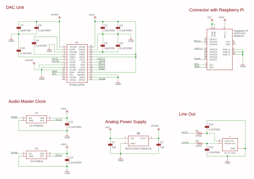

Sonopi DAC
===


Sonopi DAC is a hat card for Raspberry Pi to add a audio line output capability.
This hat board is designed to adapt to both of Raspberry pi and Raspberry pi Zero.<br>
[TI PCM5122](http://www.ti.com/product/PCM5122?keyMatch=PCM5122&tisearch=Search-EN-everything&usecase=part-number) is isntalled as DAC module, and Sonopi DAC design is compatible with [Hifiberry DAC+ Pro](https://www.hifiberry.com/shop/boards/hifiberry-dac-pro/) from Raspberry Pi point of view. It means that no special driver is necessary to use Sonopi DAC.

This hardware design is published under open source lincence. You can use and modify this design freely. There is also no limitation in commercial use.

## Project Status
Circuit schema design was done. Now I'm working on board art work.

## How to setup
Due to enable drivers for Sonopi DAC in Linux ALSA system, add a following line in ```/boot/config.txt```. Then rebooot a Raspberry Pi.

```
dtoverlay=hifiberry-dacplus
```

## PCB Design
<p align="center">

</p>
